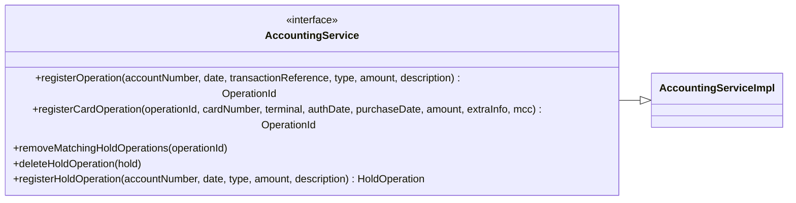

```mermaid
classDiagram
    direction LR
    class AccountingService {
        +registerOperation(accountNumber, date, transactionReference, type, amount, description) OperationId
        +registerCardOperation(operationId, cardNumber, terminal, authDate, purchaseDate, amount, extraInfo, mcc) OperationId
        +removeMatchingHoldOperations(operationId)
        +deleteHoldOperation(hold)
        +registerHoldOperation(accountNumber, date, type, amount, description) HoldOperation
    }
    <<interface>> AccountingService
    class AccountingServiceImpl {
    }
    
    AccountingService --|> AccountingServiceImpl
```
